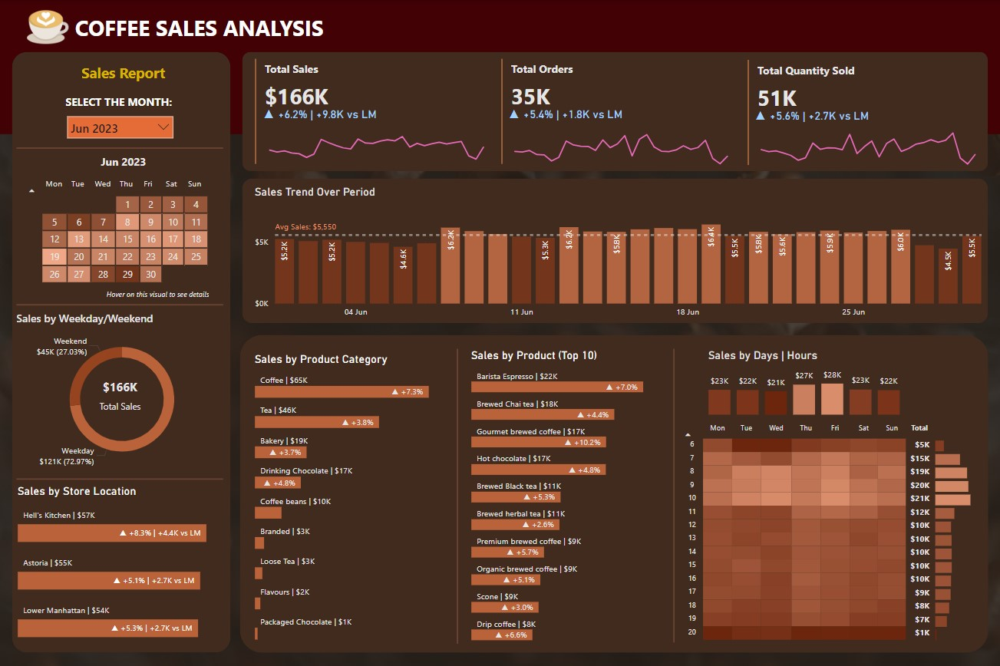

# ☕ Coffee Sales Analysis Dashboard Using Power BI & SQL

## 📌 Project Overview
This project features an interactive sales analysis dashboard developed with Power BI, using SQL for data validation. The dashboard highlights key performance indicators (KPIs), daily sales trends, popular products and peak business hours.

## 🎯 Objective
To create a professional BI dashboard that visualizes coffee sales data using Power BI, while using SQL queries to verify accuracy and strengthen data literacy.

## 📂 Dataset
- **Source**: [Coffee_Shop_Sales.xlsx](Coffee_Shop_Sales.xlsx)
- **Records**: 150,000 transaction records from January 1, 2023, to June 30, 2023
- **Columns**: 11 columns, including store location, product category, product type, quantity, and unit price

## 📸 Dashboard Preview


## 📊 Features
- **Month Filters**: Select specific months to view data.
- **KPI Cards**: Displays total sales, orders, quantity sold, and month-on-month changes.
- **Calendar Heatmap**: Color-coded by sales volume, with tooltips showing detailed metrics (sales, orders, quantity sold).
- **Daily Sales Chart**: Displays daily sales with an average sales line for comparison.
- **Weekday vs. Weekend Pie Chart**: Compares sales between weekdays and weekends.
- **Store Performance**: Displays top-performing stores by sales.
- **Top Categories & Products**: Displays the best-sellers catogries and products by sales.  
- **Sales Patterns Heatmap**: Shows sales by day and hour, with detailed metrics on hover.

## 🔍 Insights
- **Revenue Growth**: In June, total sales reached **$166,000** with **35,000** orders, marking a **6%** increase from May. This trend indicates rising customer demand and operational efficiency.
- **Sales Patterns**: The 3rd and 4th weeks of June consistently outperformed the average, reflecting sustained customer interest and higher transaction volumes.
- **Peak Business Hours**: High customer activity is observed between **7 AM to 10 AM**, indicating peak business hours during morning rush.
- **Optimal Sales Days**: Thursdays and Fridays show consistently higher sales, suggesting prime opportunities for product launches or promotions.
- **Store Performance**: Hell's Kitchen led sales with **$57,000**, followed closely by Astoria (**$55,000**) and Lower Manhattan (**$54,000**), indicating balanced performance across locations.
- **Top Categories and Products**: Coffee leads in sales volume, followed by Tea and Bakery items. Best-sellers include:
  - **Barista Espresso**: **$22,000**
  - **Brewed Chai Tea**: **$18,000**
  - **Gourmet Brewed Coffee**: **$17,000**

These figures highlight consumer preferences and revenue-driving products.

## 📝 SQL Queries for Data Validation
1. **Total Sales and Orders for Each Month**:
   ```sql
   With Sales AS (
     SELECT
       DATE_FORMAT(transaction_date, '%Y-%m') AS month,
       ROUND(SUM(transaction_qty * unit_price)) AS total_sales,
       COUNT(transaction_id) AS total_orders,
       SUM(transaction_qty) AS total_qty_sold
     FROM coffee_sales
     GROUP BY month
   )
   SELECT
     month,
     CONCAT(ROUND(total_sales/1000), 'K') AS total_sales,
     CONCAT(ROUND(total_orders/1000), 'K') AS total_orders,
     CONCAT(ROUND((total_sales - LAG(total_sales, 1) OVER (ORDER BY month)) / LAG(total_sales, 1) OVER (ORDER BY month) * 100), '%') AS sales_diff_pct
   FROM Sales;
   ```
   
2. **Sales Trends by Days for June**:
   ```sql
   SELECT
     CASE
       WHEN DAYOFWEEK(transaction_date) = 2 THEN 'Monday'
       WHEN DAYOFWEEK(transaction_date) = 3 THEN 'Tuesday'
       WHEN DAYOFWEEK(transaction_date) = 4 THEN 'Wednesday'
       WHEN DAYOFWEEK(transaction_date) = 5 THEN 'Thursday'
       WHEN DAYOFWEEK(transaction_date) = 6 THEN 'Friday'
       WHEN DAYOFWEEK(transaction_date) = 7 THEN 'Saturday'
       ELSE 'Sunday'
     END AS day_of_weeks,
     CONCAT(ROUND(SUM(transaction_qty * unit_price)/1000), 'K') AS total_sales
   FROM coffee_sales
   WHERE DATE_FORMAT(transaction_date, '%Y-%m') = '2023-06'
   GROUP BY day_of_weeks
   ORDER BY SUM(transaction_qty * unit_price) DESC;
   ```

3. **Sales Trends by Hours for June**:
   ```sql
   SELECT
     HOUR(transaction_time) AS hour_of_day,
     CONCAT(ROUND(SUM(transaction_qty * unit_price)/1000), 'K') AS total_sales
   FROM coffee_sales
   WHERE DATE_FORMAT(transaction_date, '%Y-%m') = '2023-06'
   GROUP BY hour_of_day
   ORDER BY hour_of_day;
   ```

4. **Store Performance for June**:
   ```sql
   SELECT
     store_location,
     CONCAT(ROUND(SUM(transaction_qty * unit_price)/1000), 'K') AS total_sales
   FROM coffee_sales
   WHERE DATE_FORMAT(transaction_date, '%Y-%m') = '2023-06'
   GROUP BY store_location
   ORDER BY total_sales DESC;
   ```

5. **Best-Selling Products Category for June**:
   ```sql
   SELECT
     product_category,
     CONCAT(ROUND(SUM(transaction_qty * unit_price)/1000),'K') AS total_sales
   FROM coffee_sales
   WHERE DATE_FORMAT(transaction_date, '%Y-%m') = '2023-06'
   GROUP BY product_category
   ORDER BY SUM(transaction_qty * unit_price) DESC;
   ```
   
6. **Best-Selling Products Type for June**:
   ```sql
   SELECT
     product_type,
     CONCAT(ROUND(SUM(transaction_qty * unit_price)/1000), 'K') AS total_sales
   FROM coffee_sales
   WHERE DATE_FORMAT(transaction_date, '%Y-%m') = '2023-06'
   GROUP BY product_type
   ORDER BY SUM(transaction_qty * unit_price) DESC
   LIMIT 10;
   ```
   
## 🔧 Skills Demonstrated
- **Data Visualisation**: Creating interactive visualizations to represent complex data.
- **DAX (Data Analysis Expressions)**: Writing formulas for advanced calculations.
- **SQL**: Writing and optimizing queries for data extraction and manipulation.
- **Data Cleaning**: Preprocessing data to ensure accuracy and consistency.
- **Data Analysis**: Analyzing large datasets and identifying key insights.


<!-- ## References
## 🎥 Tutorial Credit 
This project was built by following the [YouTube](https://www.youtube.com/watch?v=zMrmSctNCbE) tutorial by *Data Tutorials*.

Tutorial Link (PowerBI): https://www.youtube.com/watch?v=zMrmSctNCbE
Tutorial LInk (MySQL)  : https://www.youtube.com/watch?v=hgz0msTZtX8
-->
